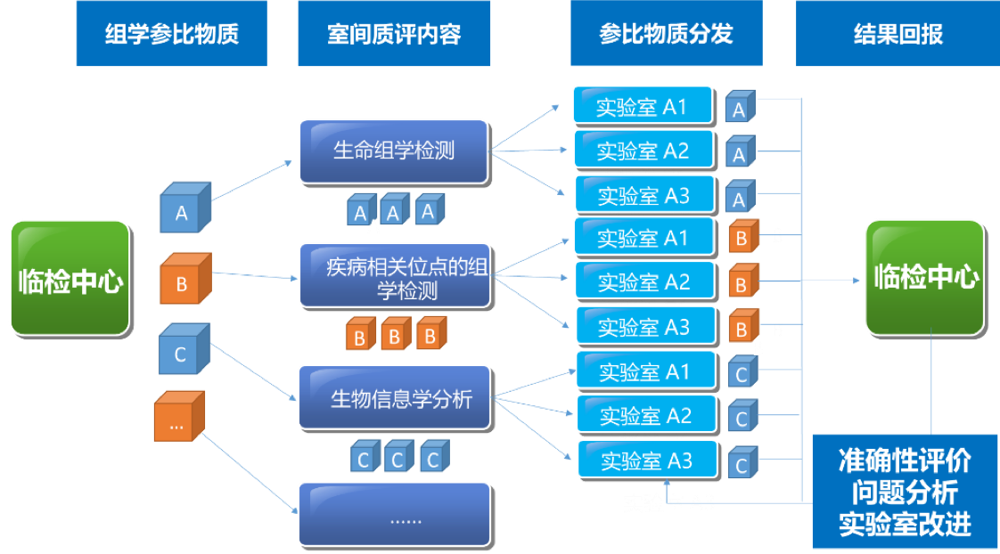
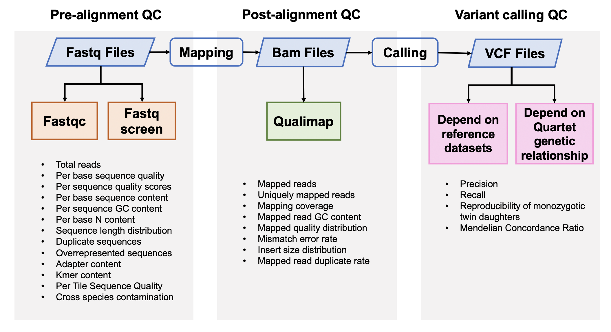
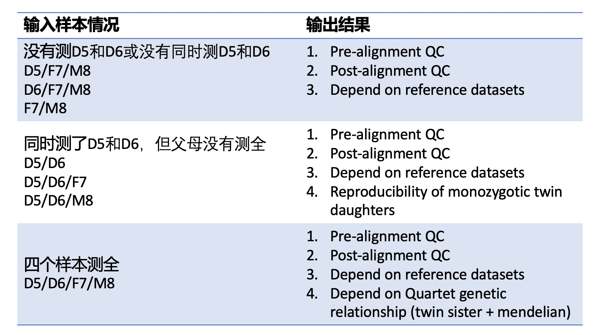
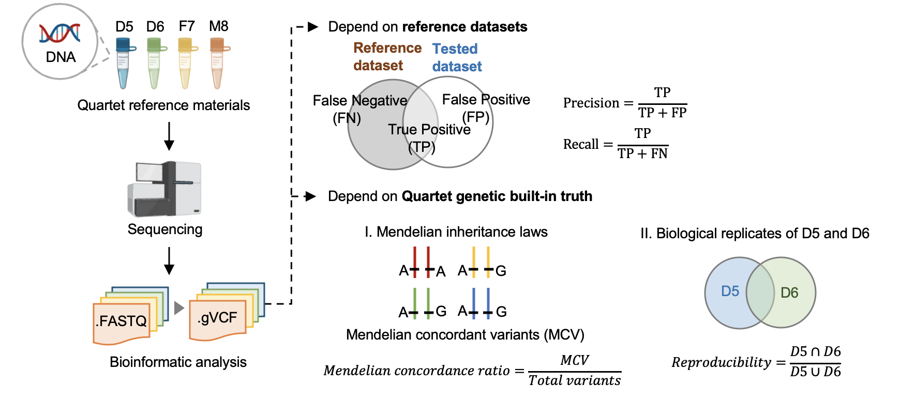

# WGS-germline Small Variants Quality Control Pipeline（Start from FASTQ files）

> Author： Run Luyao
>
> E-mail：18110700050@fudan.edu.cn
>
> Git: http://choppy.3steps.cn/renluyao/WGS_germline_datapotal.git
>
> Last Updates: 2020/11/25

## 安装指南

```
# 激活choppy环境
open-choppy-env
# 安装app
choppy install renluyao/WGS_germline_datapotal
```

## App概述——中华家系1号标准物质介绍

建立高通量全基因组测序的生物计量和质量控制关键技术体系，是保障测序数据跨技术平台、跨实验室可比较、相关研究结果可重复、数据可共享的重要关键共性技术。建立国家基因组标准物质和基准数据集，突破基因组学的生物计量技术，是将测序技术转化成临床应用的重要环节与必经之路，目前国际上尚属空白。中国计量科学研究院与复旦大学、复旦大学泰州健康科学研究院共同研制了人源中华家系1号基因组标准物质（**Quartet，一套4个样本，编号分别为LCL5，LCL6，LCL7，LCL8，其中LCL5和LCL6为同卵双胞胎女儿，LCL7为父亲，LCL8为母亲**），以及相应的全基因组测序序列基准数据集（“量值”），为衡量基因序列检测准确与否提供一把“标尺”，成为保障基因测序数据可靠性的国家基准。人源中华家系1号基因组标准物质来源于泰州队列同卵双生双胞胎家庭，从遗传结构上体现了我国南北交界的人群结构特征，同时家系的设计也为“量值”的确定提供了遗传学依据。

中华家系1号DNA标准物质的Small Variants标称值包括高置信单核苷酸变异信息、高置信短插入缺失变异信息和高置信参考基因组区。该系列标准物质可以用于评估基因组测序的性能，包括全基因组测序、全外显子测序、靶向测序，如基因捕获测序；还可用于评估测序过程和数据分析过程中对SNV和InDel检出的真阳性、假阳性、真阴性和假阴性水平，为基因组测序技术平台、实验室、相关产品的质量控制与性能验证提供标准物质和标准数据。此外，我们还可根据中华家系1号的生物遗传关系计算同卵双胞胎检测突变的一致性和符合四口之家遗传规律的一致率估计测序错误的比例，评估数据产生和分析的质量好坏。



该Quality_control APP用于全基因组测序（whole-genome sequencing，WGS）数据的质量评估，包括原始数据质控、比对数据质控和突变检出数据质控。

## 流程与参数





### 1. 原始数据质量控制

#### [Fastqc](<https://www.bioinformatics.babraham.ac.uk/projects/fastqc/>) v0.11.5

FastQC是一个常用的测序原始数据的质控软件，主要包括12个模块，具体请参考[Fastqc模块详情](<https://www.bioinformatics.babraham.ac.uk/projects/fastqc/Help/3%20Analysis%20Modules/>)。

```bash
fastqc -t <threads> -o <output_directory> <fastq_file>
```

#### [Fastq Screen](<https://www.bioinformatics.babraham.ac.uk/projects/fastq_screen/>) 0.12.0

Fastq Screen是检测测序原始数据中是否引⼊入其他物种，或是接头引物等污染，⽐比如，如果测序样本
是⼈人类，我们期望99%以上的reads匹配到⼈人类基因组，10%左右的reads匹配到与⼈人类基因组同源性
较⾼高的⼩小⿏鼠上。如果有过多的reads匹配到Ecoli或者Yeast，要考虑是否在培养细胞的时候细胞系被污
染，或者建库时⽂文库被污染。

```bash
fastq_screen --aligner <aligner> --conf <config_file> --top <number_of_reads> --threads <threads> <fastq_file>
```

`--conf` conifg 文件主要输入了多个物种的fasta文件地址，可根据自己自己的需求下载其他物种的fasta文件加入分析

`--top`一般不需要对整个fastq文件进行检索，取前100000行

### 2. 比对后数据质量控制

#### [Qualimap](<http://qualimap.bioinfo.cipf.es/>) 2.0.0

Qualimap是一个比对指控软件，包含Picard的MarkDuplicates的结果和sentieon中metrics的质控结果。

```bash
qualimap bamqc -bam <bam_file> -outformat PDF:HTML -nt <threads> -outdir <output_directory> --java-mem-size=32G 
```

### 3. 突变检出数据质量控制

突变质量控制的流程如下



#### 3.1 根据标准数据集的数据质量控制

#### [Hap.py](<https://github.com/Illumina/hap.py>) v0.3.9

hap.py是将被检测vcf结果与benchmarking对比，计算precision和recall的软件，它考虑了vcf中[突变表示形式的多样性](<https://genome.sph.umich.edu/wiki/Variant_Normalization>)，进行了归一化。

```bash
hap.py <truth_vcf> <query_vcf> -f <bed_file> --threads <threads> -o <output_filename>
```

#### 3.2 根据Quartet四口之家遗传规律的质量控制

#### Reproducibility (in-house python script)

标准数据集是根据我们整合多个平台方法，过滤不可重复检测、不符合孟德尔遗传规律的假阳性的突变。它可以评估数据产生和分析方法的相对好坏，但是具有一定的局限性，因为它排除掉了很多难测的基因组区域。我们可以通过比较同卵双胞胎突变检测的一致性对全基因组范围进行评估。

#### [Mendelian Concordance Ratio](https://github.com/sbg/VBT-TrioAnalysis) (vbt v1.1)

我们首先将四口之家拆分成两个三口之家进行孟德尔遗传的分析。当一个突变符合姐妹一致，且与父母符合孟德尔遗传规律，则认为是符合Quartet四口之家的孟德尔遗传规律。孟德尔符合率是指四个标准检测出的所有突变中满足孟德尔遗传规律的比例。

```bash
vbt mendelian -ref <fasta_file> -mother <family_merged_vcf> -father <family_merged_vcf> -child <family_merged_vcf> -pedigree <ped_file> -outDir <output_directory> -out-prefix <output_directory_prefix> --output-violation-regions -thread-count <threads>
```

## App输入文件

```bash
choppy samples WGS_germline_datapotal-latest --output samples
```

####Samples文件的输入包括

**1. inputSamplesFile**，该文件的上传至阿里云，samples文件中填写该文件的阿里云地址

请查看示例 **inputSamples.Examples.txt**

```bash
#read1	#read2	#sample_name
```

read1 是阿里云上fastq read1的地址

read2 是阿里云上fastq read2的地址

sample_name是指样本的命名

所有上传的文件应有规范的命名

Quartet_DNA_SequenceTech_SequenceMachine_SequenceSite_Sample_Replicate_Date.R1/R2.fastq.gz

SequenceTech是指测序平台，如ILM、BGI等

SequenceMachine是指测序仪器，如XTen、Nova、Hiseq（Illumina）、SEQ500、SEQ1000（BGI）等

SequenceSite是指测序单位的英文缩写

Sample是指LCL5、LCL6、LCL7、LCL8

Replicate是指技术重复，从1开始依次增加

Date是指数据获得日期，格式为20200710

后缀一定是R1/R2.fastq.gz，不可以随意更改，R1/R2不可以写成r1/r2，fastq.gz不可以写成fq.gz

各个缩写规范请见 https://fudan-pgx.yuque.com/docs/share/5baa851b-da97-47b9-b6c4-78f2b60595ab?# 《数据命名规范》

**2. project**

这个项目的名称，可以写自己可以识别的字符串，只能写英文和数字，不可以写中文

**samples文件的示例请查看choppy_samples_example.csv**

#### Quartet样本的组合问题

##### 1. 没有测LCL5和LCL6，或者没有同时测LCL5和LCL6

只给出原始数据质控、比对数据质控、与标准集的比较

##### 2. 包含LCL5和LCL6同卵双胞胎的数据，但是父母的数据不全

只给出原始数据质控、比对数据质控、与标准集的比较、同卵双胞胎一致性

##### 3. 四个quartet样本都测了

给出所有结果原始数据质控、比对数据质控、与标准集的比较、同卵双胞胎一致性，符合孟德尔遗传比例

**注意**：本app假设每个批次测的技术重复都一样，如batch 1测了LCL5、LCL6、LCL7和LCL8，batch 2 和batch 3也都测了这四个样本。本app不解决特别复杂的问题，例如batch1测了LCL5，LCL6，batch2测了LCL7和LCL8，本app只能给出原始数据质控、比对数据质控、与标准集的比较，不会把多个批次的数据合并计算孟德尔符合率和姐妹一致性。

## App输出文件

本计算会产生大量的中间结果，这里说明最后整合好的结果文件。两个tasks输出最终的结果：

#### 1. extract_tables.wdl

原始结果质控	pre_alignment.txt

比对结果指控	post_alignment.txt

突变检出指控	variants.calling.qc.txt

如果用户输入4个一组完整的家系样本则可以得到每个家庭单位的precision和recall的平均值，用于报告第一页的展示：

reference_datasets_aver-std.txt

####2. quartet_mendelian.wdl

基于Quartet家系的质控	mendelian.txt

Quartet家系结果的平均值和SD值，用于报告第一页的展示

quartet_indel_aver-std.txt

quartet_snv_aver-std.txt

#### 3. D5_D6.WDL

如果用户没有完整输入一组家庭，但有同时有D5和D6的信息，我们可以计算同卵双胞胎检测出的突变一致性，但是这部分输出暂不整合至报告中。

${project}.sister.txt

## 结果展示与解读

####1. 原始数据质量控制

原始数据质量控制主要通过考察测序数据的基本特征判断数据质量的好坏，比如数据量是否达到要求、reads的重复率是否过多、碱基质量、ATGC四种碱基的分布、GC含量、接头序列含量以及是否有其他物种的污染等等。

FastQC和FastqScreen是两个常用的原始数据质量控制软件

总结表格 **pre_alignment.txt**

| 列名                      | 说明                                 |
| ------------------------- | ------------------------------------ |
| Sample                    | 样本名，R1结尾为read1，R2结尾为read2 |
| %Dup                      | % Duplicate reads                    |
| %GC                       | Average % GC content                 |
| Total Sequences (million) | Total sequences                      |
| %Human                    | 比对到人类基因组的比例               |
| %EColi                    | 比对到大肠杆菌基因组的比例           |
| %Adapter                  | 比对到接头序列的比例                 |
| %Vector                   | 比对到载体基因组的比例               |
| %rRNA                     | 比对到rRNA序列的比例                 |
| %Virus                    | 比对到病毒基因组的比例               |
| %Yeast                    | 比对到酵母基因组的比例               |
| %Mitoch                   | 比对到线粒体序列的比例               |
| %No hits                  | 没有比对到以上基因组的比例           |

#### 2. 比对后数据质量控制

总结表格 **post_alignment.txt**

| 列名                  | 说明                                          |
| --------------------- | --------------------------------------------- |
| Sample                | 样本名                                        |
| %Mapping              | % mapped reads                                |
| %Mismatch Rate        | Mapping error rate                            |
| Mendelian Insert Size | Median insert size（bp）                      |
| %Q20                  | % bases >Q20                                  |
| %Q30                  | % bases >Q30                                  |
| Mean Coverage         | Mean deduped coverage                         |
| Median Coverage       | Median deduped coverage                       |
| PCT_1X                | Fraction of genome with at least 1x coverage  |
| PCT_5X                | Fraction of genome with at least 5x coverage  |
| PCT_10X               | Fraction of genome with at least 10x coverage |
| PCT_30X               | Fraction of genome with at least 30x coverage |

####3. 突变检出数据质量控制

具体信息 **variants.calling.qc.txt**

| 列名            | 说明                           |
| --------------- | ------------------------------ |
| Sample          | 样本名                         |
| SNV number      | 检测到SNV的数目                |
| INDEL number    | 检测到INDEL的数目              |
| SNV query       | 在高置信基因组区域中的SNV数目  |
| INDEL query     | 在高置信基因组区域中INDEL数目  |
| SNV TP          | 真阳性SNV                      |
| INDEL TP        | 真阳性INDEL                    |
| SNV FP          | 假阳性SNV                      |
| INDEL FP        | 假阳性INDEL                    |
| SNV FN          | 假阴性SNV                      |
| INDEL FN        | 假阴性INDEL                    |
| SNV precision   | SNV与标准集比较的precision     |
| INDEL precision | INDEL的与标准集比较的precision |
| SNV recall      | SNV与标准集比较的recall        |
| INDEL recall    | INDEL的与标准集比较的recall    |
| SNV F1          | SNV与标准集比较的F1-score      |
| INDEL F1        | INDEL与标准集比较的F1-score    |

与标准集比较的家庭单元整合结果**reference_datasets_aver-std.txt**

|                 | Mean | SD   |
| --------------- | ---- | ---- |
| SNV precision   |      |      |
| INDEL precision |      |      |
| SNV recall      |      |      |
| INDEL recall    |      |      |
| SNV F1          |      |      |
| INDEL F1        |      |      |

####4 Quartet家系关系评估 mendelian.txt

| 列名                          | 说明                                                         |
| ----------------------------- | ------------------------------------------------------------ |
| Family                        | 家庭名字，我们目前的设计是4个Quartet样本，每个三个技术重复，family_1是指rep1的4个样本组成的家庭单位，以此类推。 |
| Total_Variants                | 四个Quartet样本一共能检测到的变异位点数目                    |
| Mendelian_Concordant_Variants | 符合孟德尔规律的变异位点数目                                 |
| Mendelian_Concordance_Quartet | 符合孟德尔遗传的比例                                         |

家系结果的整合结果**quartet_indel_aver-std.txt**和**quartet_snv_aver-std.txt**

|                             | Mean | SD   |
| --------------------------- | ---- | ---- |
| SNV/INDEL（根据文件名判断） |      |      |

